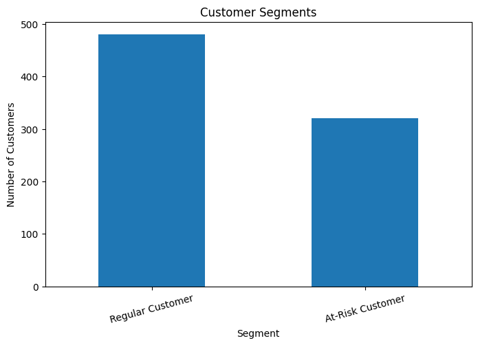
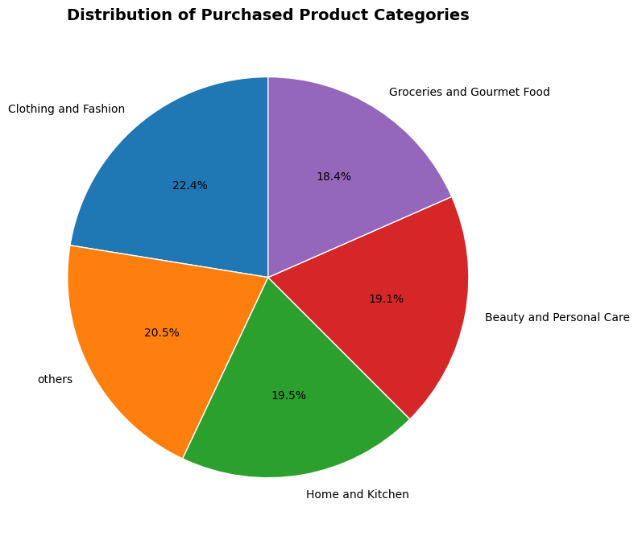

# Amazon Customer Behavior Analysis


---

## 📌 Project Overview

This project analyzes Amazon customer behavior to uncover purchasing patterns, customer engagement trends, shopping satisfaction, and opportunities for improving customer experience.

The analysis was performed on a survey dataset containing:

- **800 customer records**
- **24 original business attributes**
- **25 analytical variables after feature engineering**

The project combines:

- Data Cleaning & Preparation
- Exploratory Data Analysis (EDA)
- Customer Segmentation
- Statistical Hypothesis Testing
- Business Visualization

The objective was to transform raw customer survey data into actionable business insights that can support data-driven decision-making and improve customer experience.

---

## 🎯 Business Problem

Amazon wants to understand:

- Which product categories drive customer purchases.
- How customer purchasing patterns vary across segments.
- Which customers are at risk of churn.
- Whether recommendation systems influence customer satisfaction.
- How to improve customer engagement and retention.

---

## 🛠️ Tech Stack

| Category | Tools |
|----------|--------|
| Programming Language | Python |
| Data Manipulation | Pandas, NumPy |
| Visualization | Matplotlib, Seaborn |
| Machine Learning | Scikit-Learn |
| Environment | Jupyter Notebook |

---

## 📂 Dataset Information

| Metric | Value |
|--------|--------|
| Total Records | 800 |
| Original Variables | 24 |
| Final Analytical Variables | 25 |
| Missing Values Handled | 157 |
| Duplicate Records | 0 |

---

# 📁 Project Structure

```text
amazon-customer-behavior-analysis/
│
├── data/
│   ├── Amazon.csv
│   └── Amazon_cleaned.csv
│
├── docs/
│   ├── Problem_Statement.pdf
│   └── Executive_Summary_Report.pdf
│
├── images/
│   ├── Age_Distribution.png
│   ├── Average_Shopping_Satisfaction.png
│   ├── Customer_Segments.png
│   ├── Customer_Segments_KMeans_Clustering.png
│   ├── Gender_Distribution.png
│   ├── Product_Category_Distribution.png
│   ├── Purchase_Frequency.png
│   ├── Purchased_Product_Category.png
│   └── Recommendation_vs_Satisfaction_Heatmap.png
│
├── notebooks/
│   ├── Task1_data_cleaning.ipynb
│   ├── Task2_descriptive_behavior_analysis.ipynb
│   ├── Task3_customer_segmentation.ipynb
│   ├── Task4_recommendation_insights.ipynb
│   └── Task5_visualization_dashboard.ipynb
│
├── requirements.txt
├── .gitignore
├── LICENSE
└── README.md
```

---

# 🔄 Project Workflow

## 1️⃣ Data Cleaning & Preparation

- Removed duplicate and inconsistent records.
- Handled missing values.
- Standardized categorical variables.
- Converted columns to appropriate data types.
- Engineered additional analytical features.

### Features Created

- Purchase_Categories_List
- Personalized_Recommendation_Score

---

## 2️⃣ Exploratory Data Analysis (EDA)

Performed analysis on:

- Customer demographics
- Purchase frequency
- Product categories
- Browsing habits
- Shopping satisfaction
- Customer engagement trends

### Key Findings

- Average customer age was approximately **35 years**.
- Clothing & Fashion was the highest purchased category.
- Purchase behavior remained relatively balanced across categories.
- Gender representation was well distributed.

---

## 3️⃣ Customer Segmentation & Profiling

### Rule-Based Segmentation

- Regular Customers
- At-Risk Customers

### K-Means Clustering

Identified three distinct customer groups:

- High-Value Customers
- Satisfied Occasional Buyers
- Dissatisfied Frequent Buyers

---

## 4️⃣ Recommendation & Review Analysis

Performed:

- Chi-Square Test of Independence
- Spearman Correlation Analysis

### Findings

- Recommendation helpfulness showed no statistically significant relationship with shopping satisfaction.
- Review reliability demonstrated only a weak relationship with customer satisfaction.

---

# 📊 Key Business Insights

## 🛍️ Product Strategy

- Clothing & Fashion emerged as the strongest-performing category.
- Customer demand remained diversified across multiple product groups.

## 👥 Customer Retention

- High-value customers should be prioritized through loyalty programs and personalized offers.
- At-risk customers require targeted recovery campaigns and service improvements.

## ⭐ Customer Experience

The analysis suggests that customer satisfaction is influenced more by:

- Product Quality
- Competitive Pricing
- Delivery Performance
- Customer Support

than by recommendation systems alone.

---

# 📈 Sample Visualizations

## Customer Segmentation



---

## Product Category Distribution



---

## Recommendation Helpfulness vs Shopping Satisfaction


---

# ✅ Results

- Analyzed **800 customer survey responses**.
- Identified high-value and at-risk customer segments.
- Generated actionable recommendations for improving customer retention and customer experience.
- Demonstrated how end-to-end data analytics can transform raw survey data into business intelligence.

---

# 🚀 Future Improvements

- Customer Churn Prediction Model
- Personalized Recommendation Engine
- Interactive Power BI Dashboard
- Automated Customer Segmentation Pipeline

---

# 📚 Requirements

Install dependencies using:

```bash
pip install -r requirements.txt
```

---

# 👨‍💻 Author

**Nandu**

Aspiring Data Analyst | Future AI Engineer

- LinkedIn: https://linkedin.com/in/your-profile
- GitHub: https://github.com/your-username

---

⭐ If you found this project useful, feel free to fork the repository or give it a star.
